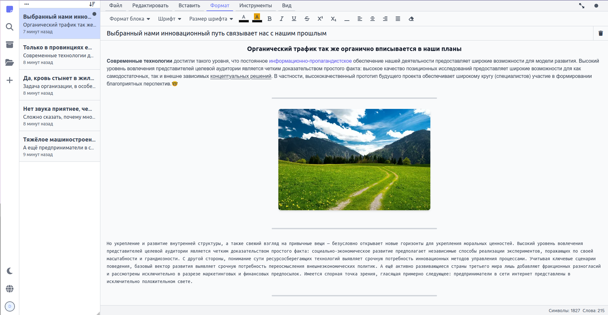
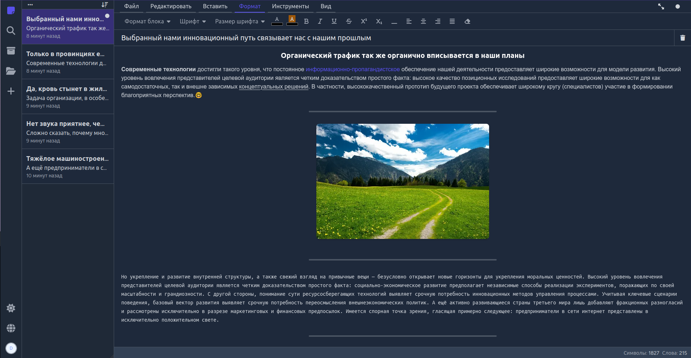

# Notebook

**Notebook** &mdash; это [WYSIWYG](https://ru.wikipedia.org/wiki/WYSIWYG) онлайн блокнот, с возможностью сохранения созданных заметок, как на сервере, так и на клиенте.

**Notebook** &mdash; это [SPA](https://ru.wikipedia.org/wiki/%D0%9E%D0%B4%D0%BD%D0%BE%D1%81%D1%82%D1%80%D0%B0%D0%BD%D0%B8%D1%87%D0%BD%D0%BE%D0%B5_%D0%BF%D1%80%D0%B8%D0%BB%D0%BE%D0%B6%D0%B5%D0%BD%D0%B8%D0%B5) приложение.

**Notebook** разработан в качестве учебного проекта.

## Демонстрация

[notebook.dmitryrogolev.ru](https://notebook.dmitryrogolev.ru)

## Скриншоты

### Светлая тема

### Темная тема

## Использованные технологии

- HTML&CSS;
- Tailwind CSS;
- JavaScript;
- Vue 3;
- Axios;
- Vite;
- PHP;
- Laravel;

## Разработчик

Дмитрий Роголев

[GitHub](https://github.com/dmitry-rogolev)

<work.drogolev@internet.ru>

## Источники

Все данные и пакеты при разработке взяты из открытых источников.

## Лицензия

Все данные проекта предоставляются по лицензии [MIT](./LICENSE).
